# 🗡️ The Legend of Zelda 2D Action RPG (Python & Pygame)

This is a 2D action role-playing game developed using Python and Pygame, inspired by classic Zelda-style gameplay.
The project is created mainly for educational and academic purposes, demonstrating Object-Oriented Programming (OOP) concepts, abstract base classes, and basic error handling in a game development environment.

## 📌 Project Overview

The game features real-time player movement, combat mechanics, magic abilities, and enemy AI inside a tile-based world.
A clean object-oriented architecture is used, where core gameplay entities inherit from a shared abstract base class to ensure consistency and extensibility.

This project is suitable for:

- Programming and OOP demonstrations

- Game development practice

## ✨ Features

- Player movement and directional animations

- Weapon attacks and magic spells

- Multiple enemy types with autonomous behavior

- Health, energy, and experience system

- Weapon and magic switching with cooldowns

- Enemy counter and win/lose conditions

- Restart functionality

- Abstract base class–based entity system

- Defensive error handling for missing assets

## 📁 Project Structure
    The Legend of Zelda
    │
    ├── audio/              # Sound effects
    ├── graphics/           # Sprites, tiles, UI images
    ├── map/                # CSV-based tile maps
    │
    └── code/
        ├── main.py         # Game entry point
        ├── level.py        # Game world and logic
        ├── player.py       # Player class
        ├── enemy.py        # Enemy AI and behavior
        ├── entity.py       # Abstract base class
        ├── weapon.py       # Weapon system
        ├── magic.py        # Magic system
        ├── ui.py           # User interface rendering
        ├── support.py      # Asset loading utilities
        ├── tile.py         # Tile map handling
        ├── particles.py   # Visual effects
        ├── upgrade.py     # Upgrade system
        └── settings.py    # Game constants and configuration

## ⚠️ Important:
The game uses `relative paths`, so it must be run from inside the code/ directory.

## ⚙️ Requirements

Python `3.10 or higher` (tested on Python 3.13)

Pygame `2.6 or higher`

Install Pygame using:

 `pip install pygame`

## ▶️ How to Run the Game

1. Open a terminal or command prompt.

2. Navigate to the code/ directory:

3.Run the game:

`python main.py`

If everything is configured correctly, the game window will open.

## 🎮 Controls

| Key | Action |
|----|-------|
| Arrow Keys (← ↑ ↓ →) | Move player |
| `SPACE` | Weapon attack |
| `Left CTRL` | Magic attack |
| `Q` | Switch weapon |
| `E` | Switch magic |
| `R` | Restart game (after win/lose) |

## 🏁 Game Rules

- If the player’s `health reaches 0`, the game ends with Game Over.

- If all enemies are `defeated`, the player `wins` the game.

- `Press R` to restart after winning or losing.

- Energy regenerates automatically over time.

- Weapon and magic switching are limited by cooldowns.

## 🧩 Object-Oriented Design
Abstract Base Class

The project uses an abstract base class named Entity to define common behavior for all interactive game objects.

class Entity(ABC):
    @abstractmethod
    def update(self):
        pass

    @abstractmethod
    def get_damage(self):
        pass

Design Benefits:

- Ensures a common interface for Player and Enemy

- Enables polymorphism through shared method calls

- Centralizes movement and collision logic

- Improves maintainability and extensibility of the codebase

## 🛡️ Error Handling

Basic error handling is implemented using `try/except` blocks to prevent runtime crashes caused by missing assets.

- Handled cases include:

- Missing image files

- Missing sound files

- Missing CSV map files

Example:

    try:
        image = pygame.image.load(path)
    except pygame.error:
        print("[ERROR] Asset missing")

This approach improves stability while keeping the code readable and beginner-friendly.

## 📊 OOP & Concept Availability (Based on This Codebase)

The following table shows which programming concepts are **actually implemented** in this project.

| Concept | Used in This Project |
|-------|---------------------|
| Object-Oriented Programming (OOP) | ✔ |
| Class | ✔ |
| Object (Instance) | ✔ |
| Method | ✔ |
| Inheritance | ✔ |
| Abstract Class | ✔ |
| Abstract Method | ✔ |
| Polymorphism | ✔ |
| Encapsulation | ✔ |
| Error Handling (try / except) | ✔ |
| Interface (explicit) | ✖ |
| Multiple Inheritance | ✖ |
| Design Patterns (Factory, Singleton, etc.) | ✖ |
| Custom Exceptions | ✖ |
| File I/O (save/load system) | ✖ |
| Database Integration | ✖ |
| Networking / Multiplayer | ✖ |

**✔** = Implemented  
**✖** = Not used

## 2. System Architecture

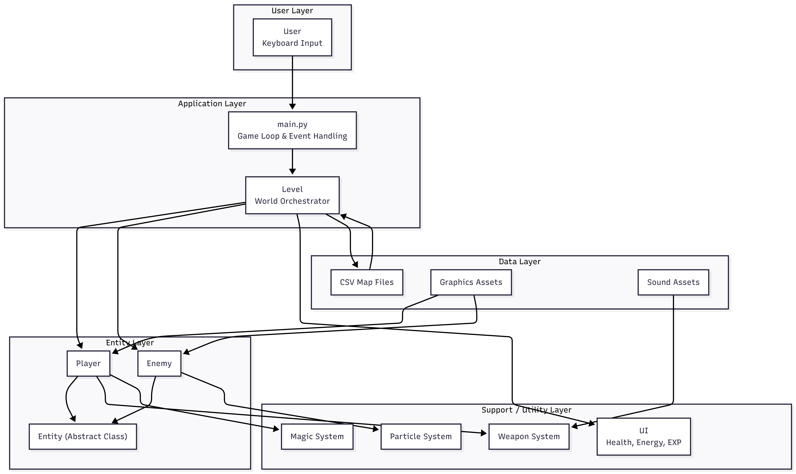

The system architecture illustrates high-level interactions among the core components:
- Game Engine Core  
- Rendering System  
- Input Handling Module  
- Game Logic Controller  
- Asset and Resource Management  

This architecture ensures separation of concerns and modular system evolution.

---

## 3. Class Diagram

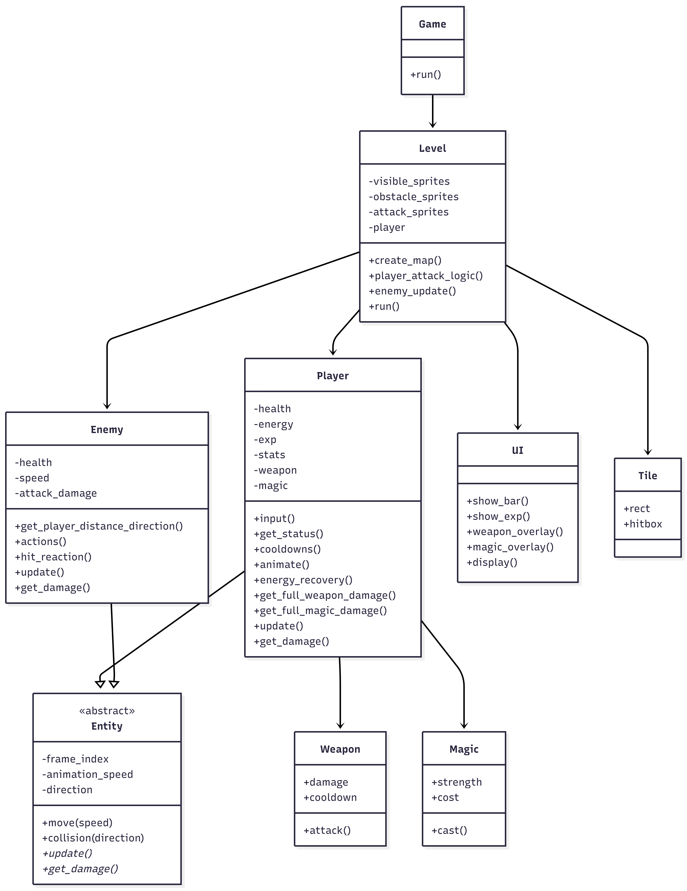

The class diagram defines the object-oriented structure of the game. Core entities include:
- **Player**
- **Enemy**
- **Tile**
- **TileMap**
- **GameController**

The design uses inheritance and composition to enhance reusability and extensibility.

### Class Diagram Explanation

This diagram provides a detailed explanation of class responsibilities and their relationships.

---

## 4. Data Flow Diagram

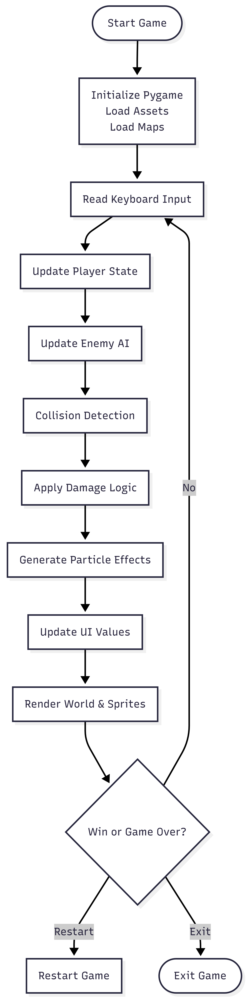

The data flow diagram illustrates how player input is processed through the system, transformed by game logic, and rendered as visual output.

---

## 5. Tile-Based Level Design Workflow

This workflow demonstrates how levels are constructed using reusable tiles arranged in a grid-based structure.

---

## 6. Full Map Design

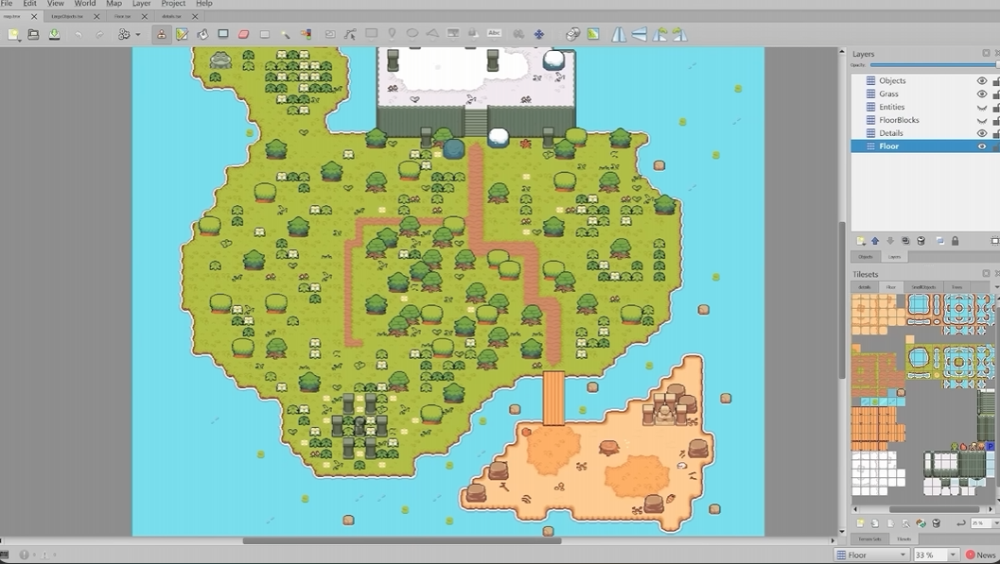

The full map design represents the complete game environment created by combining multiple tile components.

---

## 7. Tile Map Structure

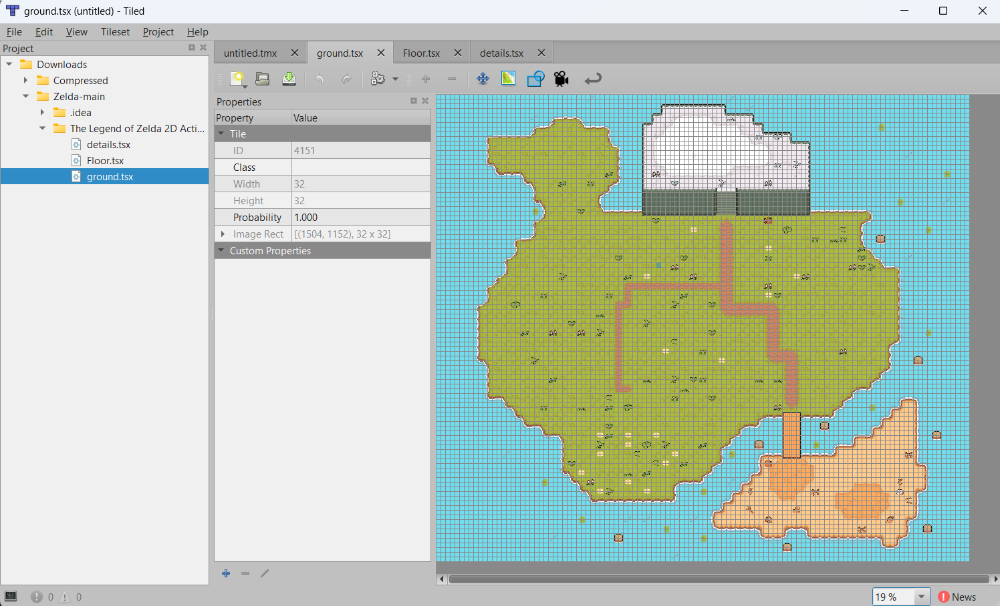

The tile map defines the spatial arrangement of tiles and serves as the foundation for collision detection and navigation.

---

## 8. Tile Components

### Base Tile
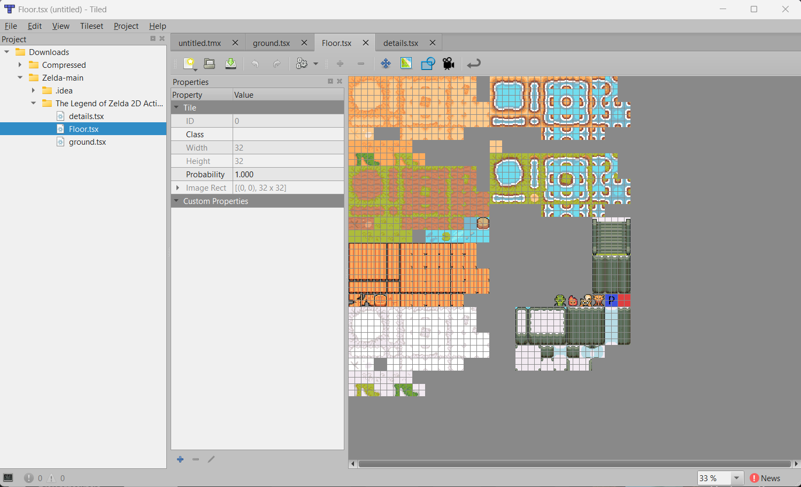

### Floor Tile
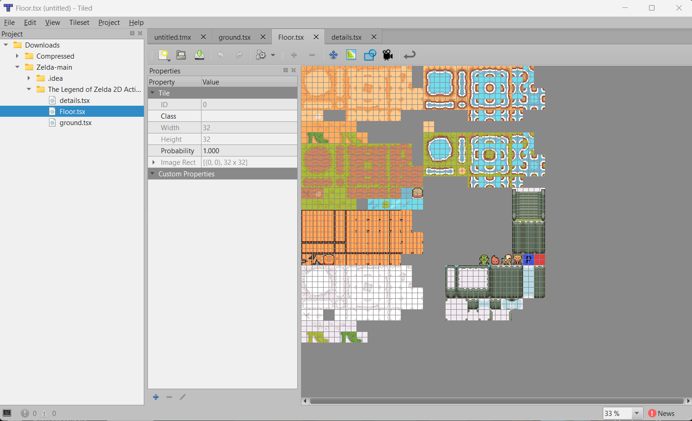

### Ground Tile

### Obstacle Tile
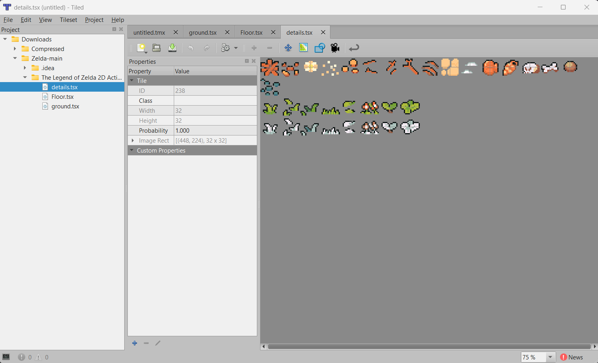

### Tile Obstacle File

These tile components form the fundamental building blocks of the game world, each assigned specific properties such as walkability and collision constraints.

---

## 9. Player Integration Test

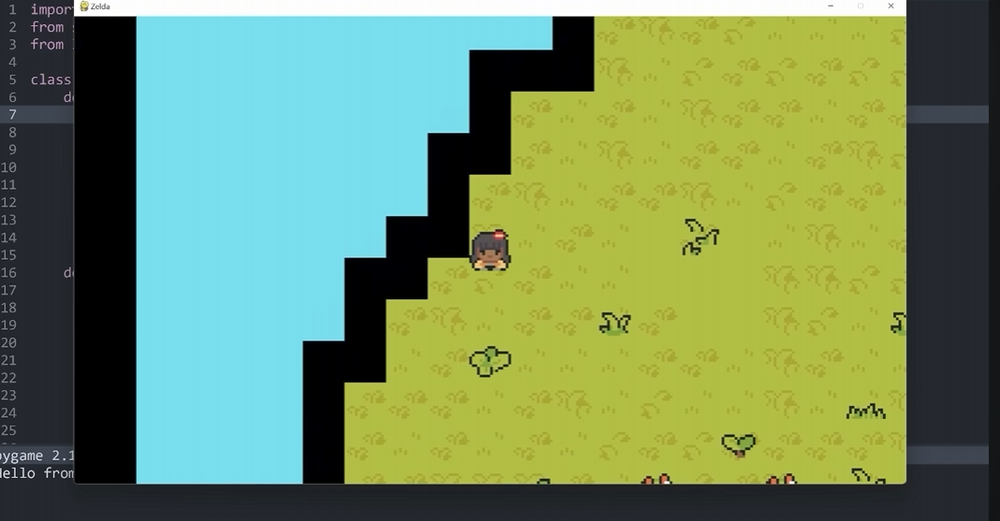

This test confirms correct player initialization, positioning, and interaction within the tile-based environment.

---

## 10. Enemy Attack Mechanism

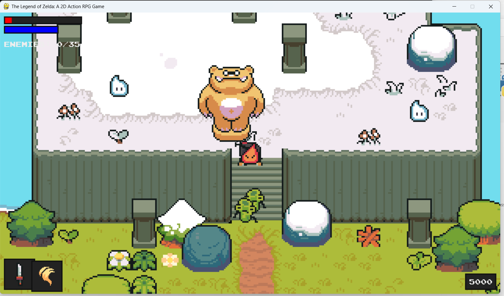

Enemies detect player proximity and initiate attack behavior based on predefined logic and collision rules.

---

## 11. Magical Attack System

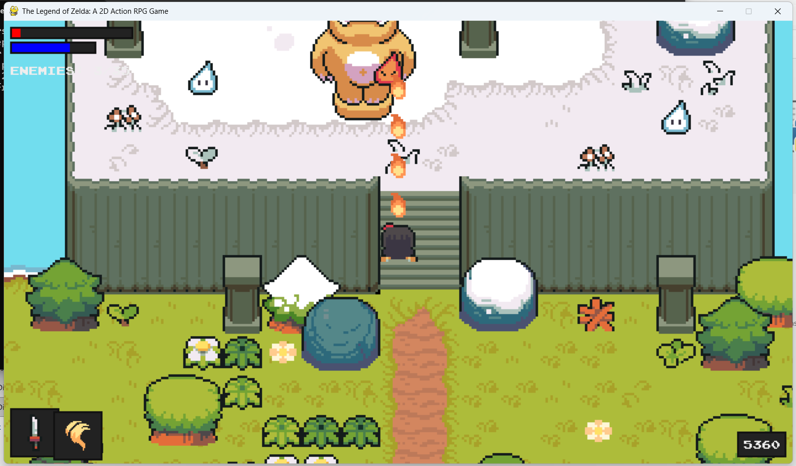

The magical attack system implements ranged combat mechanics, including projectile generation and hit detection.

---

## 12. Game Output

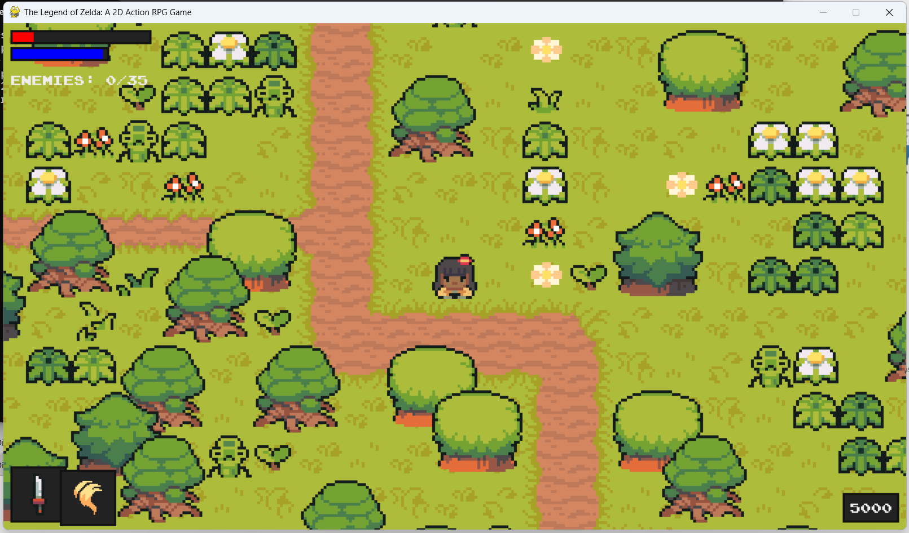

This image shows the main gameplay screen with active entities and environment rendering.

---

## 13. Game Over State

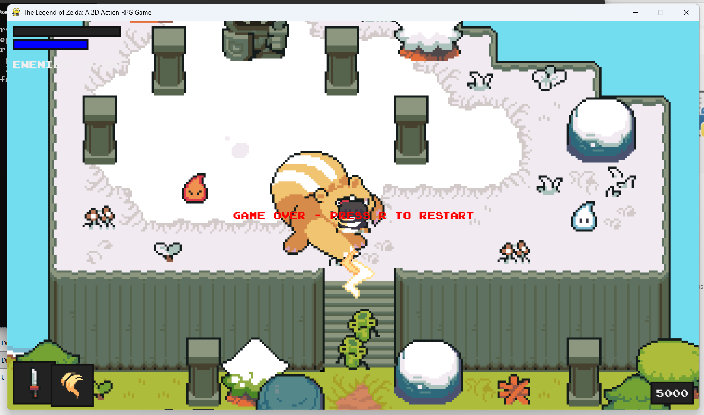

Displayed when the player fails to meet survival conditions.

---

## 14. Win Game State

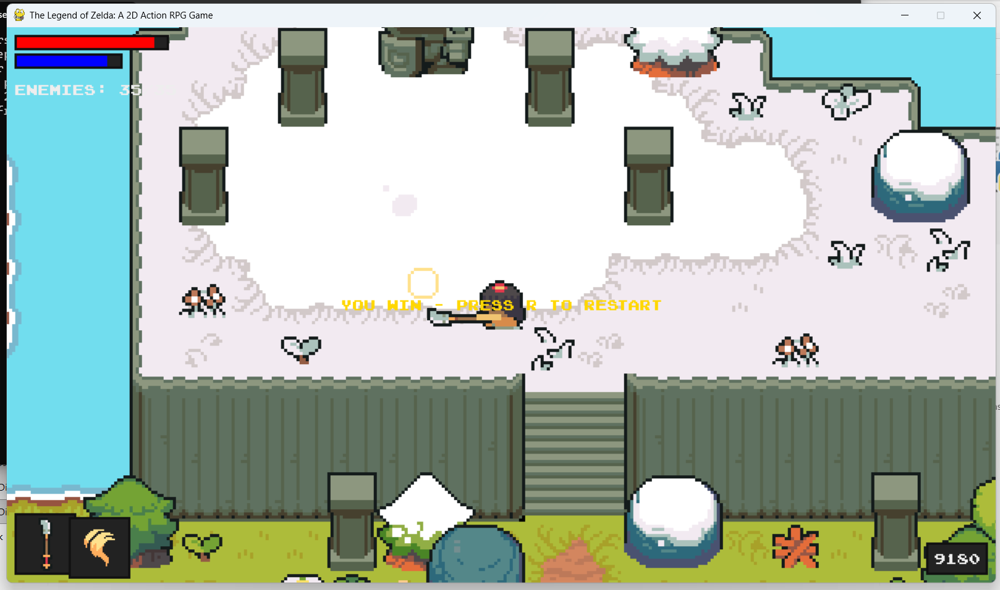

Displayed when the player successfully completes the game objectives.

---
